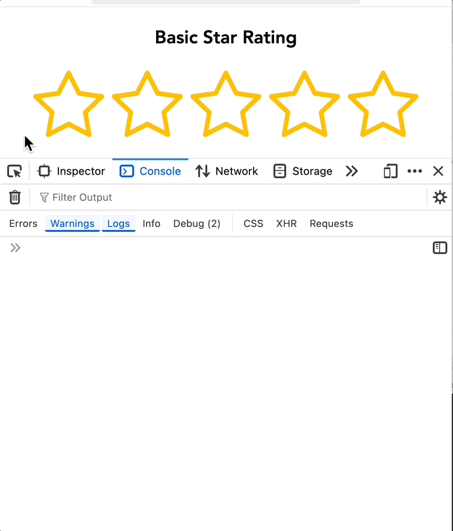
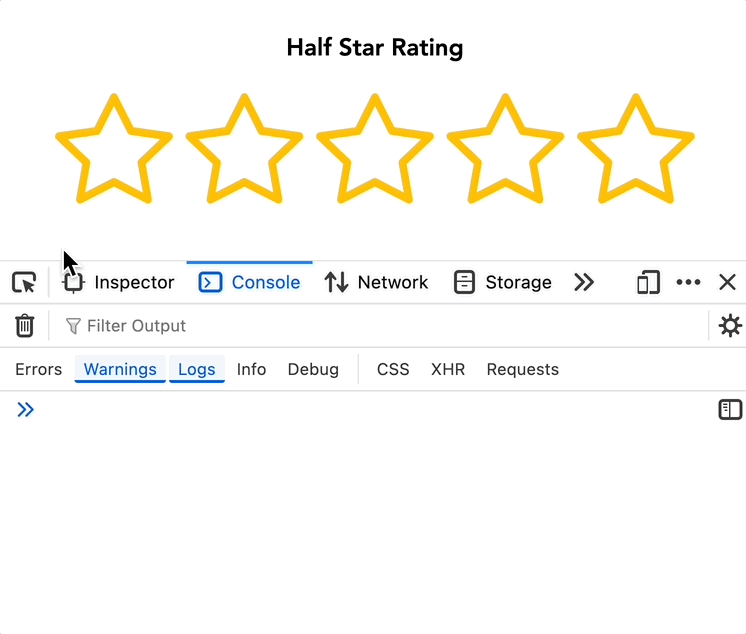
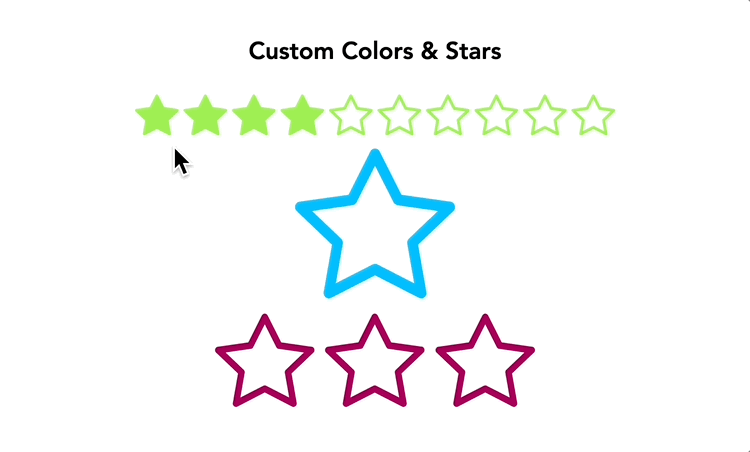
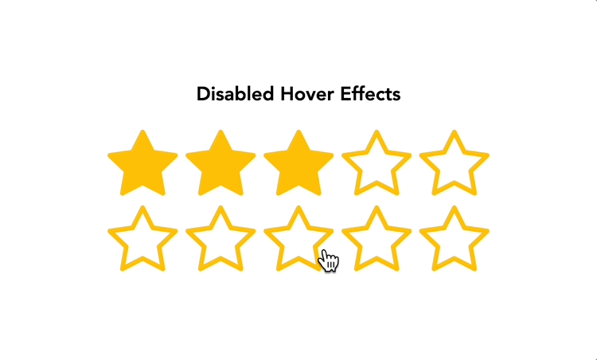

# React Star Rating Component

A highly customizable and lightweight star rating component for React applications. Supports both full and half-star ratings with extensive customization options.

## 🚀 Features

- ⭐ Configurable number of stars
- 🌟 Support for half-star ratings
- 🔄 Deselectable ratings (click same rating to cancel)
- ✨ Interactive hover effects
- 🔒 Read-only mode support
- 🎨 Customizable star colors
- 📐 Adjustable star sizes
- 🎯 TypeScript support
- 🪶 Lightweight

## 📦 Installation

### Using npm

```bash
npm install react-flexible-star-rating
```

Alternatively, you can use yarn or pnpm:

#### Using yarn

```bash
yarn add react-flexible-star-rating
```

#### Using pnpm

```bash
pnpm add react-flexible-star-rating
```

## 💻 Basic Usage

#### Using a Callback Function to Handle Rating Changes

This example demonstrates how to handle rating changes using a custom callback function. The initial rating value starts at 0, and the rating is logged to the console each time the user clicks on a star. If the user clicks the same rating again, it resets to 0.

```tsx
import { StarRating } from 'react-flexible-star-rating';

function App() {
  const handleRatingChange = (rating: number) => {
    // Logs the new rating; resets to 0 if the same rating is clicked again
    console.log(`New rating: ${rating}`);
  };

  /*
    ⚠️ Note
    
    To enable half-star ratings with an initial value of 0,
    set the `isHalfRatingEnabled` prop to `true`.

    Example usages:
      `<StarRating isHalfRatingEnabled={true} />`
      `<StarRating initialRating={0} isHalfRatingEnabled={true} />`
  */
  return <StarRating onRatingChange={handleRatingChange} />;
}
```

<hr>

#### Using useState Hook with a Handler Function

This example demonstrates how to manage the rating value using the useState hook while also logging the rating changes to the console.

```tsx
import { useState } from 'react';
import { StarRating } from 'react-flexible-star-rating';

function App() {
  const ratingValue = 3.5;
  const [rating, setRating] = useState(ratingValue);

  const handleRatingChange = (newRating: number) => {
    console.log(`New rating: ${newRating}`);
    setRating(newRating);
  };

  /* 
    ⚠️ Important Note: Proper Usage of `initialRating` 

      ❌ Incorrect (Avoid this):  
        `<StarRating initialRating={rating} />`  
        - Binding `initialRating` to state can cause half-ratings to behave like integers.  

      ✅ Correct (Use one of these approaches):  
        - Static value: `<StarRating initialRating={3.5} />`  

        - Defined variable:  
          `const ratingValue = 3.5;`
          ...
          `<StarRating initialRating={ratingValue} />`  

      This ensures proper half-rating functionality of the component.
  */
  return <StarRating initialRating={ratingValue} onRatingChange={handleRatingChange} />;
}
```

<hr>

#### Using setState Function Directly

This example demonstrates how to manage the rating value using the `useState` hook without needing a separate handler function. The state is updated directly when the user selects a new rating.

```tsx
import { useState } from 'react';
import { StarRating } from 'react-flexible-star-rating';

function App() {
  const ratingValue = 3.5;
  const [rating, setRating] = useState(ratingValue);

  return <StarRating initialRating={ratingValue} onRatingChange={setRating} />;
}
```

### Next.js Usage

⚠️ **Important Note for Next.js Users**

When using this component in Next.js applications, you must add the `"use client"` directive at the top of your component file. This is because the star rating component uses React hooks (`useState`, `useCallback`), which can only be used in client-side components.

#### Sample Usage in Next.js

```tsx
'use client'; // ⚠️ Required: do not forget this line

import { useState } from 'react';
import { StarRating } from 'react-flexible-star-rating';

export default function RatingComponent() {
  const initialRatingValue = 2;
  const [rating, setRating] = useState(initialRatingValue);

  return (
    <div>
      <h2>Product Rating</h2>
      <StarRating initialRating={initialRatingValue} onRatingChange={setRating} />
      <p>Current Rating: {rating}</p>
    </div>
  );
}
```

## ⚙️ Props

| Prop                  | Type                       | Default     | Description                                                           |
| --------------------- | -------------------------- | ----------- | --------------------------------------------------------------------- |
| `starsLength`         | `number`                   | `5`         | Number of stars to display                                            |
| `isHalfRatingEnabled` | `boolean`                  | `false`     | Enable half-star ratings                                              |
| `isHoverEnabled`      | `boolean`                  | `true`      | Enable hover effects                                                  |
| `isReadOnly`          | `boolean`                  | `false`     | Make the rating read-only                                             |
| `initialRating`       | `number`                   | `0`         | Initial rating value                                                  |
| `dimension`           | `number`                   | `30`        | Size (width & height) of stars in rem                                 |
| `color`               | `string`                   | `"#FFD700"` | Star color in HEX format                                              |
| `onRatingChange`      | `(rating: number) => void` | `undefined` | Accepts setState or custom callback function to handle rating changes |

<hr>

## 📝 Usage Examples

### Basic Star Rating

<hr>
  
<hr>

#### Sample Usage

```tsx
<StarRating starsLength={5} initialRating={0} onRatingChange={(rating) => console.log(rating)} />
```

### Half-Star Rating

<hr>

<hr>

#### Sample Usage

```tsx
<StarRating
  starsLength={5}
  initialRating={3.5}
  isHalfRatingEnabled={true}
  onRatingChange={(rating) => console.log(rating)}
/>
```

### Read-only Rating Display

<hr>
  
<hr>

#### Sample Usage

```tsx
<StarRating starsLength={5} initialRating={4} isReadOnly={true} />
```

### Custom Styled Rating

<hr>

<hr>

#### Sample Usage

```tsx
<StarRating starsLength={10} initialRating={5} dimension={50} color="#FF5733" />
```

### Disabled Hover Effects

<hr>

<hr>

#### Sample Usage

```tsx
<StarRating starsLength={5} initialRating={3} isHoverEnabled={false} />
<StarRating starsLength={5} initialRating={1.5} isHoverEnabled={false} />
```

## 🔍 API Details

### Rating Validation

- When `isHalfRatingEnabled` is `true`, ratings can be in increments of 0.5
- When `isHalfRatingEnabled` is `false`, only integer ratings are allowed
- `initialRating` must be between 0 and `starsLength`
- The component will throw an error if:
  - `initialRating` is greater than `starsLength`
  - `initialRating` is less than 0
  - `starsLength` is less than or equal to 0
  - `isHoverEnabled` is true when `isReadOnly` is true

### Rating Deselection

The component supports rating deselection:

- Click on the same rating twice to cancel/deselect it
- The rating will reset to 0
- The `onRatingChange` callback will be called with 0

### Performance Optimization

- Uses React's `useCallback` hooks for optimal rendering
- Efficient state updates using React's state management

### Browser Compatibility

- Supports all modern browsers (Chrome, Firefox, Safari, Edge)
- Touch events supported for mobile devices

## 🔮 TODO Features

Here are some exciting features planned for future releases:

- 🌐 Live Demo - An interactive demo website to showcase component features
- ⌨️ Keyboard Navigation - Full keyboard support for better accessibility
  - Arrow keys for rating selection
  - Space/Enter for rating confirmation
  - Escape key for rating reset
- ♿ Screen Reader Accessibility - Enhanced ARIA support for better screen reader compatibility
  - Improved ARIA labels and descriptions
  - Better announcement of rating changes
  - Enhanced focus management

## 📧 Contact

For questions or suggestions, email me at: `suhatanriverdi.dev@gmail.com`

<a href="https://www.buymeacoffee.com/suhatanriverdi" target="_blank"></a>

_Your support means a lot to me to continue the development of open-source projects like this._

<small>_Created by Süha Tanrıverdi, 2025_ </small>
