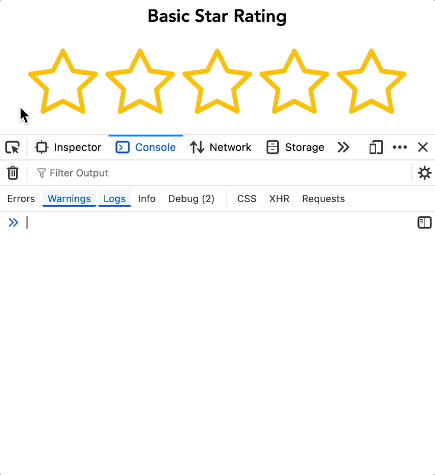

# React Star Rating Component

A highly customizable and lightweight star rating component for React applications. Supports both full and half-star ratings with extensive customization options.

## 🚀 Features

- ⭐ Configurable number of stars
- 🌟 Support for half-star ratings
- 🔄 Deselectable ratings (click same rating to cancel)
- ✨ Interactive hover effects
- 🔒 Read-only mode support
- 🎨 Customizable star colors
- 📐 Adjustable star sizes
- 🎯 TypeScript support
- 🪶 Lightweight

## 📦 Installation

### Using npm

```bash
npm install react-flexible-star-rating
```

Alternatively, you can use yarn or pnpm:

#### Using yarn

```bash
yarn add react-flexible-star-rating
```

#### Using pnpm

```bash
pnpm add react-flexible-star-rating
```

## 💻 Basic Usage

#### Using a Callback Function

This example demonstrates how to handle rating changes using a custom callback function. The rating value is logged to the console, and if the user clicks the same rating again, it resets to 0.

```tsx
import { StarRating } from 'react-flexible-star-rating';

function App() {
  const handleRatingChange = (rating: number) => {
    // Logs the new rating; resets to 0 if the same rating is clicked again
    console.log(`New rating: ${rating}`);
  };

  return <StarRating initialRating={3.5} onRatingChange={handleRatingChange} />;
}
```

<hr>

#### Using State with a Handler Function

This example demonstrates how to manage the rating value using the useState hook. The handleRatingChange function updates the state when the user selects a new rating.

```tsx
import { useState } from 'react';
import { StarRating } from 'react-flexible-star-rating';

function App() {
  const [rating, setRating] = useState(3.5);

  const handleRatingChange = (newRating: number) => {
    setRating(newRating); // Updates the state with the new rating
  };

  return <StarRating initialRating={rating} onRatingChange={handleRatingChange} />;
}
```

<hr>

#### Using State with Direct Setter

This is a more concise approach where the setRating function is passed directly to onRatingChange, eliminating the need for an intermediary function.

```tsx
import { useState } from 'react';
import { StarRating } from 'react-flexible-star-rating';

function App() {
  const [rating, setRating] = useState(3.5);

  return <StarRating initialRating={rating} onRatingChange={setRating} />;
}
```

## ⚙️ Props

| Prop                  | Type                       | Default     | Description                                                           |
| --------------------- | -------------------------- | ----------- | --------------------------------------------------------------------- |
| `starsLength`         | `number`                   | `5`         | Number of stars to display                                            |
| `isHalfRatingEnabled` | `boolean`                  | `false`     | Enable half-star ratings                                              |
| `isHoverEnabled`      | `boolean`                  | `true`      | Enable hover effects                                                  |
| `isReadOnly`          | `boolean`                  | `false`     | Make the rating read-only                                             |
| `initialRating`       | `number`                   | `0`         | Initial rating value                                                  |
| `dimension`           | `number`                   | `30`        | Size (width & height) of stars in rem                                 |
| `color`               | `string`                   | `"#FFD700"` | Star color in HEX format                                              |
| `onRatingChange`      | `(rating: number) => void` | `undefined` | Accepts setState or custom callback function to handle rating changes |

## 📝 Usage Examples

### Basic Star Rating

<hr>
  
<hr>

#### Sample Usage

```tsx
<StarRating starsLength={5} initialRating={0} onRatingChange={(rating) => console.log(rating)} />
```

### Half-Star Rating

<hr>

<hr>

#### Sample Usage

```tsx
<StarRating
  starsLength={5}
  initialRating={3.5}
  isHalfRatingEnabled={true}
  onRatingChange={(rating) => console.log(rating)}
/>
```

### Read-only Rating Display

<hr>
  
<hr>

#### Sample Usage

```tsx
<StarRating starsLength={5} initialRating={4} isReadOnly={true} />
```

### Custom Styled Rating

<hr>

<hr>

#### Sample Usage

```tsx
<StarRating starsLength={10} initialRating={5} dimension={50} color="#FF5733" />
```

### Disabled Hover Effects

<hr>

<hr>

#### Sample Usage

```tsx
<StarRating starsLength={5} initialRating={3} isHoverEnabled={false} />
<StarRating starsLength={5} initialRating={1.5} isHoverEnabled={false} />
```

## 🔍 API Details

### Rating Validation

- When `isHalfRatingEnabled` is `true`, ratings can be in increments of 0.5
- When `isHalfRatingEnabled` is `false`, only integer ratings are allowed
- `initialRating` must be between 0 and `starsLength`
- The component will throw an error if:
  - `initialRating` is greater than `starsLength`
  - `initialRating` is less than 0
  - `starsLength` is less than or equal to 0
  - `isHoverEnabled` is true when `isReadOnly` is true

### Rating Deselection

The component supports rating deselection:

- Click on the same rating twice to cancel/deselect it
- The rating will reset to 0
- The `onRatingChange` callback will be called with 0

### Performance Optimization

- Uses React's `useCallback` hooks for optimal rendering
- Efficient state updates using React's state management

### Browser Compatibility

- Supports all modern browsers (Chrome, Firefox, Safari, Edge)
- Touch events supported for mobile devices
